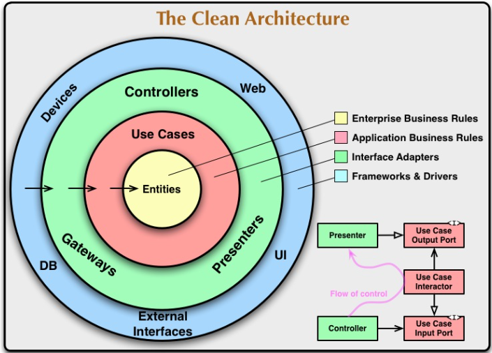

# 构建整洁应用实践
## 什么是整洁应用
Bob大叔在在他的[blog](https://blog.cleancoder.com/uncle-bob/2012/08/13/the-clean-architecture.html)中介绍了一种被其称之为"整洁的架构"的代码组织方式, 它的示意图如下：
  

                           
整洁架构的核心在于：把业务逻辑(business rule或者说这里的usecase)置于架构的中心,  技术细节被放置在了整个架构的外部， 以plugin(插件)的形式attach在业务逻辑上（因为是插件， 所以是可以替换的）， 代码依赖只能是从外向内， 从具体到抽象而不能反过来， 位于中心的业务逻辑绝对不知道外部的技术细节。
这种方式的好处在于：
-  不依赖于具体的技术细节， 位于外层的技术细节可以web框架、 数据库等， 注意外部的技术细节彼此之间也是不依赖的  
-  更容易测试， 测试在Use Cases中可以实现， 不会涉及外部的代码  
  
类似的架构方式还有"[六边形架构](https://alistair.cockburn.us/hexagonal-architecture/)"。

## 示例应用简介
正如上文提到的usecase(具体用例)是架构的中心， 所以在开始我们的实践之前， 我们需要想象一个业务， 一个简单的方便说明问题的业务 -- 我们将为一家名为GreatTime Coffee的线上咖啡商店开发一个App，这个App的最核心功能是用户展示GreatTime Coffee公司旗下的所有咖啡产品目录以及方便用户查询单一咖啡的价格信息。

同时， 为了方便对比， 我们的代码会同时包含传统的实现方式以及整洁架构的实现方式。


## 传统架构
基于传统方式的代码位于greattime_coffee1目录下。运行方式，进入greattime_coffee1目录， 运行：
```go
go run .
```
传统架构的代码组织方式, 是一种典型的"三明治"式的架构，整个依赖链大概是下面这样：  
```
用户请求  -> controller -> 数据库
```

这种方式在逻辑上是比较清晰的， 但是随着业务的发展， 你最后会发现controller中的代码越来越多， 越来越乱， 到最后可能覆水难收。  
重要原因在于， controller把业务逻辑和技术细节全部都杂糅在了一起， 但是说到底， 业务是业务， 技术细节是技术细节， 它们不可同日而语。

## 整洁架构
相对的， 整洁架构实现了对关注点的分离， 也就是业务代码只管业务逻辑， 不会关心技术细节是怎样的， 它只会依赖一个抽像的东西， 可以帮助提实现业务的某一些功能即可，这个抽象的东西， 就是我们说的接口对象。  
在代码结构上（代码位于greattime_coffee2目录下）， 整洁架构似乎会复杂一些：
```
├─internal
│  ├─app
│  ├─controller
│  │  └─http
│  ├─entity
│  └─usecase
│      ├─coupon
│      └─repo
└─pkg
    ├─httpserver
    └─logger
```
上面的组织方式很好地分离了"内"(internal)和"外"(pkg)， 在internal中我们会实现
entity， usecase, 以及位于第三层的controller(但是不再关心业务逻辑， 也不会直接调用某个数据库了， 而是委托usecase去实现逻辑)。

所以技术细节， 会以插件的形式注入到我们的usecase中，例如：
```golang
coffeeServiceUsecase := usecase.New(
    repo.NewInMemoryRepo(),
    coupon.NewRandomCuppon(),
)
```
我们调用了位于usecase内部的两个实例化函数`repo.NewInMemoryRepo`以及`coupon.NewRandomCuppon`来构建我们需要的依赖， 这里需要注意的是，`NewInMemoryRepo`以及`NewRandomCuppon`都不需要参数。 但是， 在真实场景下， 比如usecase可能会依赖数据库, 这里我们以postgresql为例， 代码会类似下面这样：

```golang
pg := postgres.NewPg() // postgres会位于最外层的pkg目录下

coffeeServiceUsecase := usecase.New(
    repo.PgRepo(pg),
)
```
这里我们注入了一个数据库依赖， 哪一天我需要换一种数据库， 我完全可以在不影响业务代码的情况下轻松实现（前面的三明治模式就非常困难和麻烦）， 这或许就是整洁架构的意义（在测试场景下，有点尤为突出）。

## Reference
[go-clean-template](https://github.com/evrone/go-clean-template)
